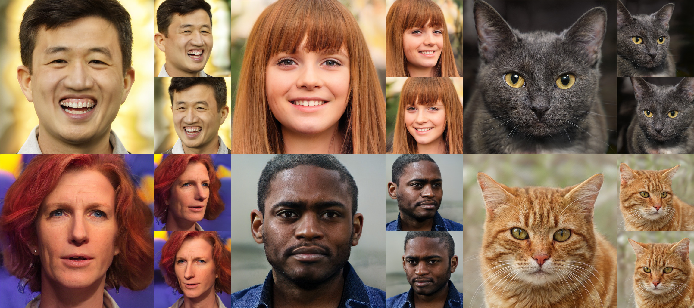

## Efficient Geometry-aware 3D Generative Adversarial Networks (EG3D)<br><sub>Official PyTorch implementation of the CVPR 2022 paper</sub>



**Efficient Geometry-aware 3D Generative Adversarial Networks**<br>
Eric R. Chan*, Connor Z. Lin*, Matthew A. Chan*, Koki Nagano*, Boxiao Pan, Shalini De Mello, Orazio Gallo, Leonidas Guibas, Jonathan Tremblay, Sameh Khamis, Tero Karras, and Gordon Wetzstein<br>*\* equal contribution*<br>
<br>https://nvlabs.github.io/eg3d/<br>

Abstract: *Unsupervised generation of high-quality multi-view-consistent images and 3D shapes using only collections of single-view 2D photographs has been a long-standing challenge. Existing 3D GANs are either compute-intensive or make approximations that are not 3D-consistent; the former limits quality and resolution of the generated images and the latter adversely affects multi-view consistency and shape quality. In this work, we improve the computational efficiency and image quality of 3D GANs without overly relying on these approximations. We introduce an expressive hybrid explicit-implicit network architecture that, together with other design choices, synthesizes not only high-resolution multi-view-consistent images in real time but also produces high-quality 3D geometry. By decoupling feature generation and neural rendering, our framework is able to leverage state-of-the-art 2D CNN generators, such as StyleGAN2, and inherit their efficiency and expressiveness. We demonstrate state-of-the-art 3D-aware synthesis with FFHQ and AFHQ Cats, among other experiments.*

For business inquiries, please visit our website and submit the form: [NVIDIA Research Licensing](https://www.nvidia.com/en-us/research/inquiries/)

## Requirements

* We recommend Linux for performance and compatibility reasons.
* 1&ndash;8 high-end NVIDIA GPUs. We have done all testing and development using V100, RTX3090, and A100 GPUs.
* 64-bit Python 3.8 and PyTorch 1.11.0 (or later). See https://pytorch.org for PyTorch install instructions.
* CUDA toolkit 11.3 or later.  (Why is a separate CUDA toolkit installation required?  We use the custom CUDA extensions from the StyleGAN3 repo. Please see [Troubleshooting](https://github.com/NVlabs/stylegan3/blob/main/docs/troubleshooting.md#why-is-cuda-toolkit-installation-necessary)).
* Python libraries: see [environment.yml](./eg3d/environment.yml) for exact library dependencies.  You can use the following commands with Miniconda3 to create and activate your Python environment:
  - `cd eg3d`
  - `conda env create -f environment.yml`
  - `conda activate eg3d`

## Getting started

Pre-trained networks are stored as `*.pkl` files that can be referenced using local filenames. See [Models](./docs/models.md) for download links to pre-trained checkpoints.


## Generating media

```.bash
# Generate videos using pre-trained model

python gen_videos.py --outdir=out --trunc=0.7 --seeds=0-3 --grid=2x2 \
    --network=networks/network_snapshot.pkl

# Generate the same 4 seeds in an interpolation sequence

python gen_videos.py --outdir=out --trunc=0.7 --seeds=0-3 --grid=1x1 \
    --network=networks/network_snapshot.pkl
```

```.bash
# Generate images and shapes (as .mrc files) using pre-trained model

python gen_samples.py --outdir=out --trunc=0.7 --shapes=true --seeds=0-3 \
    --network=networks/network_snapshot.pkl
```

We visualize our .mrc shape files with [UCSF Chimerax](https://www.cgl.ucsf.edu/chimerax/).

To visualize a shape in ChimeraX do the following:
1. Import the `.mrc` file with `File > Open`
1. Find the selected shape in the Volume Viewer tool
    1. The Volume Viewer tool is located under `Tools > Volume Data > Volume Viewer`
1. Change volume type to "Surface"
1. Change step size to 1
1. Change level set to 10
    1. Note that the optimal level can vary by each object, but is usually between 2 and 20. Individual adjustment may make certain shapes slightly sharper
1. In the `Lighting` menu in the top bar, change lighting to "Full"


## Interactive visualization

This release contains an interactive model visualization tool that can be used to explore various characteristics of a trained model.  To start it, run:

```.bash
python visualizer.py
```

See the [`Visualizer Guide`](./docs/visualizer_guide.md) for a description of important options.


## Using networks from Python

You can use pre-trained networks in your own Python code as follows:

```.python
with open('ffhq.pkl', 'rb') as f:
    G = pickle.load(f)['G_ema'].cuda()  # torch.nn.Module
z = torch.randn([1, G.z_dim]).cuda()    # latent codes
c = torch.cat([cam2world_pose.reshape(-1, 16), intrinsics.reshape(-1, 9)], 1) # camera parameters
img = G(z, c)['image']                           # NCHW, float32, dynamic range [-1, +1], no truncation
```

The above code requires `torch_utils` and `dnnlib` to be accessible via `PYTHONPATH`. It does not need source code for the networks themselves &mdash; their class definitions are loaded from the pickle via `torch_utils.persistence`.

The pickle contains three networks. `'G'` and `'D'` are instantaneous snapshots taken during training, and `'G_ema'` represents a moving average of the generator weights over several training steps. The networks are regular instances of `torch.nn.Module`, with all of their parameters and buffers placed on the CPU at import and gradient computation disabled by default.

The generator consists of two submodules, `G.mapping` and `G.synthesis`, that can be executed separately. They also support various additional options:

```.python
w = G.mapping(z, conditioning_params, truncation_psi=0.5, truncation_cutoff=8)
img = G.synthesis(w, camera_params)['image]
```

Please refer to [`gen_samples.py`](eg3d/gen_samples.py) for complete code example.

## Preparing datasets

Datasets are stored as uncompressed ZIP archives containing uncompressed PNG files and a metadata file `dataset.json` for labels. Each label is a 25-length list of floating point numbers, which is the concatenation of the flattened 4x4 camera extrinsic matrix and flattened 3x3 camera intrinsic matrix. Custom datasets can be created from a folder containing images; see `python dataset_tool.py --help` for more information. Alternatively, the folder can also be used directly as a dataset, without running it through `dataset_tool.py` first, but doing so may lead to suboptimal performance.

**FFHQ**: Download and process the [Flickr-Faces-HQ dataset](https://github.com/NVlabs/ffhq-dataset) using the following commands.

1. Ensure the [Deep3DFaceRecon_pytorch](https://github.com/sicxu/Deep3DFaceRecon_pytorch/tree/6ba3d22f84bf508f0dde002da8fff277196fef21) submodule is properly initialized
```.bash
git submodule update --init --recursive
```

2. Run the following commands
```.bash
cd dataset_preprocessing/ffhq
python runme.py
```

Optional: preprocessing in-the-wild portrait images. 
In case you want to crop in-the-wild face images and extract poses using [Deep3DFaceRecon_pytorch](https://github.com/sicxu/Deep3DFaceRecon_pytorch/tree/6ba3d22f84bf508f0dde002da8fff277196fef21) in a way that align with the FFHQ data above and the checkpoint, run the following commands 
```.bash
cd dataset_preprocessing/ffhq
python preprocess_in_the_wild.py --indir=INPUT_IMAGE_FOLDER
```


**AFHQv2**: Download and process the [AFHQv2 dataset](https://github.com/clovaai/stargan-v2/blob/master/README.md#animal-faces-hq-dataset-afhq) with the following.

1. Download the AFHQv2 images zipfile from the [StarGAN V2 repository](https://github.com/clovaai/stargan-v2/)
2. Run the following commands:
```.bash
cd dataset_preprocessing/afhq
python runme.py "path/to/downloaded/afhq.zip"
```

**ShapeNet Cars**: Download and process renderings of the cars category of [ShapeNet](https://shapenet.org/) using the following commands.
NOTE: the following commands download renderings of the ShapeNet cars from the [Scene Representation Networks repository](https://www.vincentsitzmann.com/srns/).

```.bash
cd dataset_preprocessing/shapenet
python runme.py
```

## Training

You can train new networks using `train.py`. For example:

```.bash
# Train with FFHQ from scratch with raw neural rendering resolution=64, using 8 GPUs.
python train.py --outdir=~/training-runs --cfg=ffhq --data=~/datasets/FFHQ_512.zip \
  --gpus=8 --batch=32 --gamma=1 --gen_pose_cond=True

# Second stage finetuning of FFHQ to 128 neural rendering resolution (optional).
python train.py --outdir=~/training-runs --cfg=ffhq --data=~/datasets/FFHQ_512.zip \
  --resume=~/training-runs/ffhq_experiment_dir/network-snapshot-025000.pkl \
  --gpus=8 --batch=32 --gamma=1 --gen_pose_cond=True --neural_rendering_resolution_final=128

# Train with Shapenet from scratch, using 8 GPUs.
python train.py --outdir=~/training-runs --cfg=shapenet --data=~/datasets/cars_train.zip \
  --gpus=8 --batch=32 --gamma=0.3

# Train with AFHQ, finetuning from FFHQ with ADA, using 8 GPUs.
python train.py --outdir=~/training-runs --cfg=afhq --data=~/datasets/afhq.zip \
  --gpus=8 --batch=32 --gamma=5 --aug=ada --neural_rendering_resolution_final=128 --gen_pose_cond=True --gpc_reg_prob=0.8
```

Please see the [Training Guide](./docs/training_guide.md) for a guide to setting up a training run on your own data.

Please see [Models](./docs/models.md) for recommended training configurations and download links for pre-trained checkpoints.


The results of each training run are saved to a newly created directory, for example `~/training-runs/00000-ffhq-ffhq512-gpus8-batch32-gamma1`. The training loop exports network pickles (`network-snapshot-<KIMG>.pkl`) and random image grids (`fakes<KIMG>.png`) at regular intervals (controlled by `--snap`). For each exported pickle, it evaluates FID (controlled by `--metrics`) and logs the result in `metric-fid50k_full.jsonl`. It also records various statistics in `training_stats.jsonl`, as well as `*.tfevents` if TensorBoard is installed.

## Quality metrics

By default, `train.py` automatically computes FID for each network pickle exported during training. We recommend inspecting `metric-fid50k_full.jsonl` (or TensorBoard) at regular intervals to monitor the training progress. When desired, the automatic computation can be disabled with `--metrics=none` to speed up the training slightly.

Additional quality metrics can also be computed after the training:

```.bash
# Previous training run: look up options automatically, save result to JSONL file.
python calc_metrics.py --metrics=fid50k_full \
    --network=~/training-runs/network-snapshot-000000.pkl

# Pre-trained network pickle: specify dataset explicitly, print result to stdout.
python calc_metrics.py --metrics=fid50k_full --data=~/datasets/ffhq_512.zip \
    --network=ffhq-128.pkl
```

Note that the metrics can be quite expensive to compute (up to 1h), and many of them have an additional one-off cost for each new dataset (up to 30min). Also note that the evaluation is done using a different random seed each time, so the results will vary if the same metric is computed multiple times.

References:
1. [GANs Trained by a Two Time-Scale Update Rule Converge to a Local Nash Equilibrium](https://arxiv.org/abs/1706.08500), Heusel et al. 2017
2. [Demystifying MMD GANs](https://arxiv.org/abs/1801.01401), Bi&nacute;kowski et al. 2018

<!-- ## License

Copyright &copy; 2021, NVIDIA Corporation & affiliates. All rights reserved.

This work is made available under the [Nvidia Source Code License](https://github.com/NVlabs/stylegan3/blob/main/LICENSE.txt). -->

## Citation

```
@inproceedings{Chan2022,
  author = {Eric R. Chan and Connor Z. Lin and Matthew A. Chan and Koki Nagano and Boxiao Pan and Shalini De Mello and Orazio Gallo and Leonidas Guibas and Jonathan Tremblay and Sameh Khamis and Tero Karras and Gordon Wetzstein},
  title = {Efficient Geometry-aware {3D} Generative Adversarial Networks},
  booktitle = {CVPR},
  year = {2022}
}
```

## Development

This is a research reference implementation and is treated as a one-time code drop. As such, we do not accept outside code contributions in the form of pull requests.

## Acknowledgements

We thank David Luebke, Jan Kautz, Jaewoo Seo, Jonathan Granskog, Simon Yuen, Alex Evans, Stan Birchfield, Alexander Bergman, and Joy Hsu for feedback on drafts, Alex Chan, Giap Nguyen, and Trevor Chan for help with diagrams, and Colette Kress and Bryan Catanzaro for allowing use of their photographs. This project was in part supported by Stanford HAI and a Samsung GRO. Koki Nagano and Eric Chan were partially supported by DARPA’s Semantic Forensics (SemaFor) contract (HR0011-20-3-0005). The views and conclusions contained in this document are those of the authors and should not be interpreted as representing the official policies, either expressed or implied, of the U.S. Government. Distribution Statement "A" (Approved for Public Release, Distribution Unlimited).
