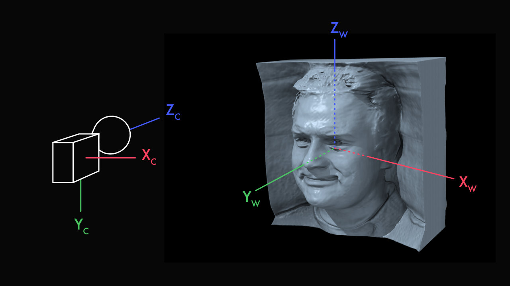

## Guide to Training

Tips and tricks for setting up your own training runs. This guide looks at the most important options when setting up a training run with new data.

---

## Preparing your data

Your dataset should be a directory that includes your images and a dataset.json file that fits the following format:

```
{
    'labels': [
        ["img_0000.png", [0.1, 0.2, -0.3, 0.4, 0.5, 0.6, 0.7, 0.8, 0.8, 0.9, 1.0, 1.1, 1.2, 1.3, 1.4, -1.5, 1.6, 1.7, 1.8, -1.9, 2.0, 2.1, -2.2, 2.3, 2.4, -2.5]]
    ]
}
```
Each entry of the 'labels' list contains the relative filename and a 25-length camera parameters vector. The first 16 entries of the camera parameters are the 4x4 OpenCV Cam2World extrinsics matrix. The last 9 parameters are the 3x3 intrinsics matrix normalized by image size.

## Camera Conventions



### Intrinsics
We use normalized intrinsics so we can ignore image size during training. You can easily normalize intrinsics by dividing by your image size in number of pixels. For a camera intrinsics matrix with focal length f_x, f_y, principal point offset x_0, y_0, axis skew s, and image size (in pixels) size_x, size_y:

```
unnormalized                                normalized

[[ f_x, s,    x_0]             [[ f_x/size_x,   s,            x_0/size_x]
 [ 0,   f_y,  y_0]      ->      [ 0,            f_y/size_y,   y_0/size_y]
 [ 0,   0,    1  ]]             [ 0,            0,            1         ]]
```

As a sanity check, after normalization, your principal point should be close to 0.5, 0.5.

## Mirrored Data

We recommend you mirror data manually by duplicating images and creating a duplicate camera pose label in your dataset.json file. See the FFHQ dataset preprocessing scripts for an example.

## Uncompressed Zip

While you can train with simply a directory of images and the dataset.json file, it's sometimes easier to zip the directory into an archive for more efficient transfer on networked systems. We use uncompressed .zip archives so that reading from the archive is as efficient as possible.

```
cd my_dataset
zip -0 -r ../my_dataset.zip *
```

## Examples

Please see the dataset_preprocessing directory for example scripts for preparing FFHQ, AFHQ, ShapeNet datasets.

---

## Basic Training and Rendering Parameters

### Finetuning

`--resume=my_pretrained_model.pkl`

Once you have your data, it's time to start some training runs. If possible, we highly recommend using finetuning off of a pre-trained model. Doing so dramatically improves the rate of convergence, so you can get better results in much less time. If your new dataset is front-facing, FFHQ is a great choice. If your dataset is imaged from 360 degrees, ShapeNet is going to be a better option.

### Batch Size

`--gpus=8 --batch=32`

If possible, use 8 gpus and a batch size of 32; these were our defaults for all of our major experiments. However, good results have also been obtained with small batch sizes on one or two GPUs, especially when finetuning is used. The batch size you specify is split evenly across the number of GPUs. If your batch size is small, use stronger R1 regularization (higher gamma).

### Gamma

`--gamma=5`

The strength of R1 regularization is an important hyperparameter for ensuring stability of GAN training. The best value of gamma may vary widely between datasets. If you have nothing to go on, ```--gamma=5``` is a safe choice. If training seems stable, and your model starts to produce diverse and reasonable outputs, you can try lowering gamma. If you experience training instability or mode collapse, try increasing gamma. In general, if your batch size is small, or if your images are large, you will need more regularization (higher gamma).

Finding the optimal value of gamma is important for maximizing your image quality.

### Generator Pose Conditioning

`--gen_pose_cond=True --gpc_reg_prob=0.8`

Generator pose conditioning (GPC) is when we condition the generator on the rendering camera pose. In doing so, we allow the camera pose to influence the identity of the scene, which is important for modelling pose-appearance correlations.

The above options control the presence and strength of GPC. `--gpc_reg_prob` adjusts probability of swapping regularization—when instead of conditioning on the rendering camera pose, we instead condition with a random camera pose. A high (close to 1) swapping regularization makes the conditioning vector "unreliable" and the effect of GPC weaker; a low (close to 0) swapping regularization means the effect of GPC is stronger but may introduce artifacts.

Our recommendation when starting with a new dataset is to train *without* generator pose conditioning by setting `--gen_pose_cond=False`. Whether you should use GPC is dependent on your dataset. If you use synthetic data, and know that all of your scenes are sampled randomly, you probably won't need it; by contrast, if you know your dataset has clear pose-appearance biases, turning on GPC may improve your image quality. After obtaining reasonable results without generator pose conditioning, you can try turning it on. Try setting your `--gpc_reg_prob` to somewhere between `0.5` and `0.8`.


### Neural Rendering Resolution

`--neural_rendering_resolution_final=128`

Neural rendering resolution is the resolution at which we volumetrically render, and it is independent of your output image size. In general, low neural rendering resolutions (e.g. 64) are faster at training and at inference. Higher neural rendering resolutions (e.g. 128) are more compute intensive but have less aliasing, produce more detailed shapes, and more view-consistent 3D renderings. For most models, we train at neural rendering resolution of 64 and optionally continue training with a neural rendering resolution of 128. **For the best quality and multi-view consistency, we strongly recommend fine-tuning at the 128 neural rendering resolution.**  

To train with a static neural rendering resolution of 64:
```.bash
python train.py \
  --neural_rendering_resolution_initial=64 \
  ...
```

To train with a neural rendering resolution that changes gradually increases from 64 to 128 over 1 million images:
```.bash
python train.py \
  --neural_rendering_resolution_initial=64 \
  --neural_rendering_resolution_final=128 \
  --neural_rendering_resolution_fade_kimg=1000 \
  ...
```

Please see **Two-stage training** (Section 3 of the supplemental) for additional details.

### Adaptive Discriminator Augmentation

With small datasets, the discriminator can memorize the real images and destabilize training. Enable ADA by setting `--aug=ada`. Note that for small datasets, you'll see the largest benefit if you use both ADA as well as finetuning.

### Discriminator Pose Conditioning Regularization

We condition the discriminator on the rendering camera pose in order to aid convergence to accurate 3D objects. However, it's sometimes possible for discriminator pose conditioning to hurt training stability. If your input poses are accurate and unique, e.g. if they were generated synthetically with random camera poses, it's possible for the discriminator to memorize which poses must be paired with which images. We can regularize this effect by corrupting these poses with Gaussian noise before they are seen by the discriminator. To add 1 standard deviation of Gaussian noise, set `--disc_c_noise=1`.

---

## Rendering Config

```
if opts.cfg == 'shapenet':
    rendering_options.update({
        'depth_resolution': 64,
        'depth_resolution_importance': 64,
        'ray_start': 'auto',
        'ray_end': 'auto',
        'box_warp': 1.6,
        'white_back': True,
        'avg_camera_radius': 1.7,
        'avg_camera_pivot': [0, 0, 0],
    })
```

The last step before training a model is to set up a rendering config, which you can do in the `train.py` script.

**depth_resolution:** How many uniformly spaced samples to take along each ray.

**depth_resolution_importance:** How many importance samples to take along each ray.

**ray_start:** The distance between the camera origin and the first depth sample along the ray. Can be a float, e.g. `0.1` or `'auto'`, if you want to use the ray-box intersection of the volume to set ray bounds.

**ray_end:** The distance between the camera origin and the last depth sample along the ray. Can be a float, e.g. `1.5` or `'auto'`, if you want to use the ray-box intersection of the volume to set ray bounds.

**box_warp:** The side length of the cube spanned by the tri-planes. The box is axis-aligned, centered at the origin, and has limits [-box_warp/2, -box_warp/2, -box_warp/2] - [box_warp/2, box_warp/2, box_warp/2]. If `box_warp=1.8`, it has vertices at [0.9, 0.9, 0.9], [0.9, 0.9, -0.9], ...

**white_back:** Controls the color of rays that pass through the volume without encountering any solid objects. Set to True if your background is white; set to false if the background is black.

**avg_camera_radius:** The average radius of the camera, assuming it rotates on a sphere about the origin. This option is unused at training—it is used only to specify the camera path in the visualizer.

**avg_camera_pivot:** The point at which the camera looks, assuming it rotates on a sphere about the origin. This option is unused at training—it is used only to specify the camera path in the visualizer.

---

Taking all of the above into account, you'll likely have a command that is similar to this one:

`python train.py --data=/data/mydata.zip --gpus=2 --batch=8 --cfg=myconfig --gamma=5 --resume=shapenet.pkl --outdir=training_runs`

For the training commands used to create the supplied pre-trained models, see [Models](./models.md).

Good luck!