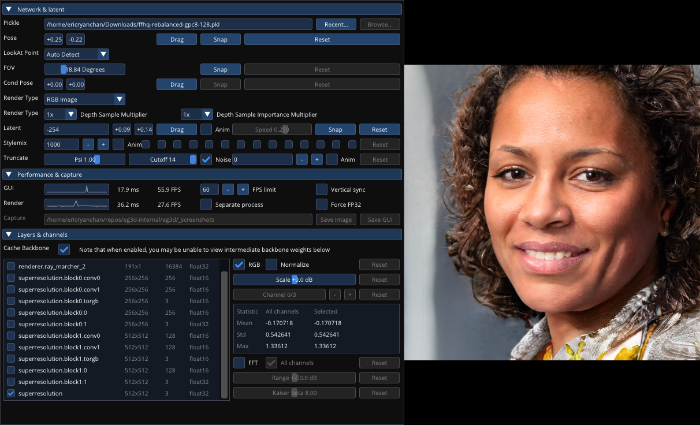

## Guide to the Visualizer

We include a 3D visualizer that is based on the amazing tool introduced in StyleGAN3. The following document describes important options and sliders of the visualizer UI.

TLDR:
1. Press the "Pickle/Recent" button to select a pretrained EG3D model.
2. Click and drag the "Latent/Drag" button to sweep latent codes and change the scene identity.
3. Click and drag the rendering on the right to move the camera.

---

## Network & Latent

### Pickle
Specifiy the path of the model checkpoint to visualize. You have a few options:
1. Drag and drop the .pkl file from your file browser into the visualizer window
1. Type the path (or url) of your .pkl file into the text field
1. Press the recent box to access a list of recently used checkpoints

### Pose
Control the pitch and yaw of the camera by clicking and dragging the rendering on the right. By default, the camera rotates on a sphere with fixed radius, pointed at the origin.

### FOV
Control the field of view of the camera with this slider to zoom the camera in and out. For FFHQ, 18 degrees is about right; for ShapeNet, use a FOV of 45 degrees.

### Cond Pose
The pose with which we condition the generator (see Generator Pose Conditioning in Sec. 4.4). By default, we condition on the fixed frontal camera pose. For models trained without generator pose conditioning, this will have no effect.

### Render Type
Toggle between the final super-resolved output (RGB image), a depth map (Depth image) or the raw neural rendering without super resolution (Neural rendering).

### Depth Sample Multiplier / Depth Sample Importance Multiplier
Adjust the number of depth samples taken per ray. By increasing the number of depth samples, we reduce flickering artifacts caused by depth aliasing, which leads to more temporally-consistent videos. However, the tradeoff is slower rendering and slightly blurrier images. At 1X / 1X, render in the visualizer with the same number of depth samples as at training; at 2X / 2X, take double the uniformly spaced and double the importance samples per ray. As an example: we train FFHQ with 48 uniformly spaced depth samples and 48 importance samples per ray. Using 2X / 2X, we instead take 96 uniformly spaced depth samples and 96 importance samples (192 total).

### Latent
The seed for the latent code, *z*, that is the input to the generator. Click and drag the "drag" button to sweep between scene identities. Press the "Anim" checkbox to play an animation sweeping through latent codes.

### Stylemix
The seed for a second latent code for style mixing. Check the boxes on the right to select which layers should be conditioned by this second code.

### Truncate
Apply the truncation trick in *w*-space to trade off fidelity for diversity. Psi=1 means no truncation. Psi=0 gives the "average" scene learned by the generator. A Psi between 0 and 1, e.g. 0.7 is a compromise that reduces diversity somewhat but improves the overall consistency in quality. (See the Truncation Trick in StyleGAN for more info.)

---

## Performance & capture

### Render

Displays the framerate of rendering. On an RTX 3090, with neural rendering resolution of 128, and with 48 uniform and 48 importance depth samples, we get 25-30 FPS.

### Capture

Save screenshots to the directory specified by the text field. Save image saves just the rendering; Save GUI saves the complete pane including the user interface.

---

## Layers & channels

### Cache backbone
For rendering where the scene identity (the latent code *z* and conditioning pose) remain static, but rendering parameters (the camera pose, fov, render type, etc...) change, we can enable 'backbone caching' which will enable us to cache and reuse the existing triplanes computed by the convolutional backbone. Backbone caching slightly improves rendering speed.

### Layer viewer
View and analyze the intermediate weights and layers of the generator. Scroll through the network and select a layer using the checkbox. Use the "Channel" slider on the right to view different activations. Do note that when 'cache backbone' is enabled, you will be unable to view the intermediate weights of the convolutional backbone/triplanes.
